### 1. 安装 mod

你需要安装 `MaLiLib`、`Litematica`、`Litematica Printer`、`Syncmatica` 这四个 mod。

- **MaLiLib**：这是投影 mod 的前置。
- **Litematica**：这是投影 mod 的本体。
- **Litematica Printer**：这是投影 mod 的一个附属，可以更方便地放方块。
- **Syncmatica**：这是共享投影 mod，用于多人游戏共享投影图。

---

### 快捷键设置

按 `M` 打开投影菜单，点击配置菜单进行配置。

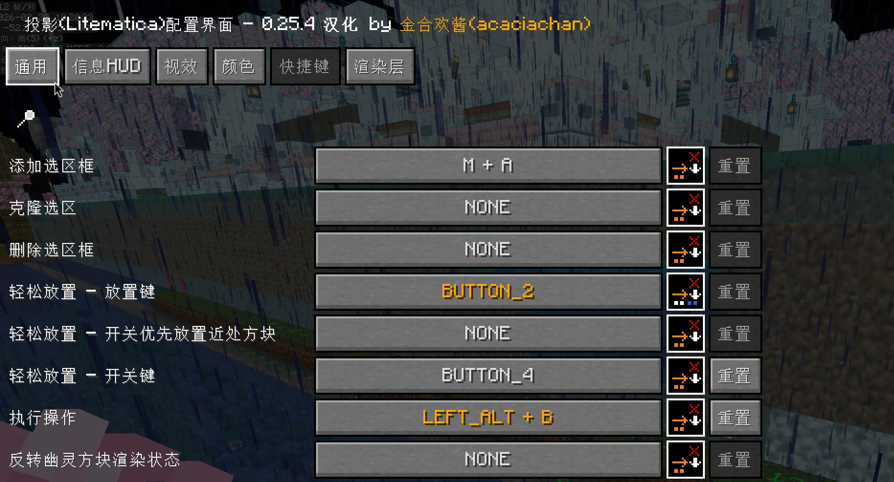

你需要设置：

- 轻松放置开关的快捷键
- 执行操作的快捷键

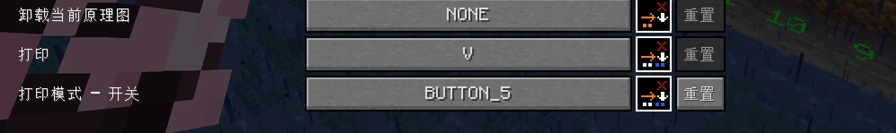

- 打印模式开关的快捷键

其他的可以自己研究。

---

### 2. 原理图教程

投影的原理图是文件后缀为 `.litematic` 的文件。  
投影文件夹在游戏根目录的 `schematics` 文件夹。  
你可以先启动一下游戏，会自动生成该文件夹。  
将投影文件放到这个文件夹里面。

进入一个存档，使用默认的 `M` 键打开投影菜单：

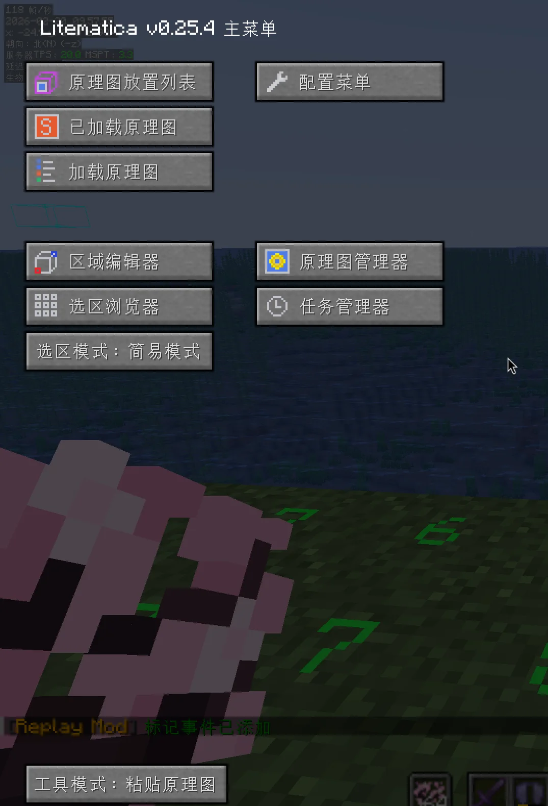

点击“加载原理图”：

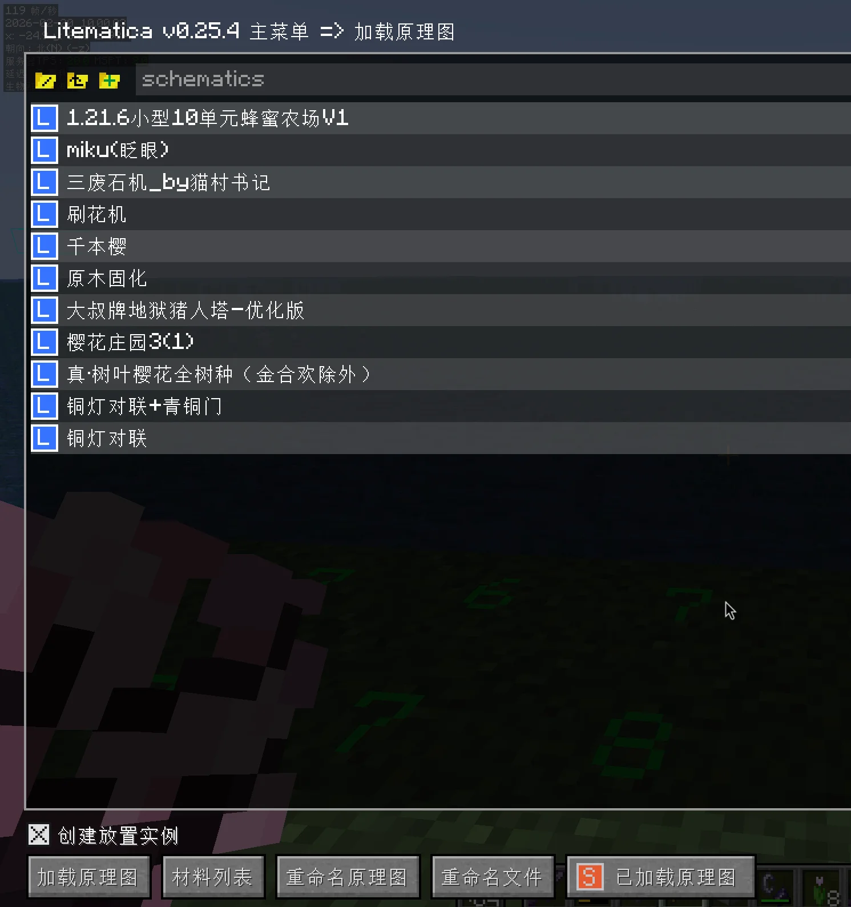

选择一个原理图加载，默认会创建一个放置。  
然后点击“原理图放置列表”：

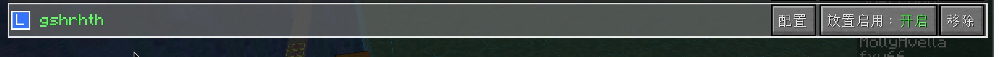

点击“配置”：

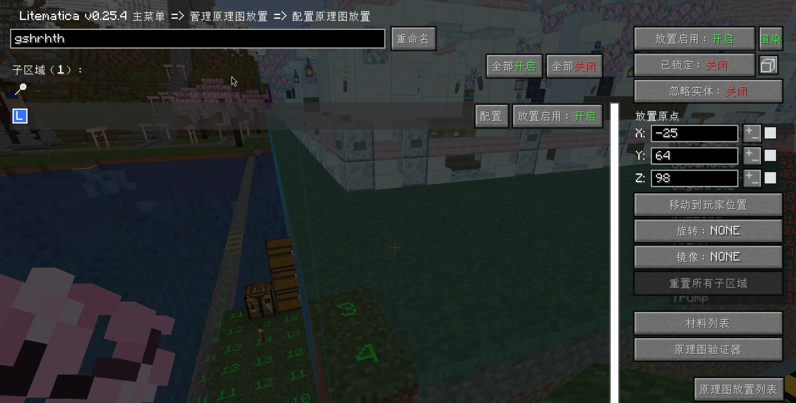

这里可以细调原理图：

- 放置原点就是位置。
- “移动到玩家位置”可以快速将放置原点移动到玩家的位置。
- “旋转”可以调整方向。

“材料列表”可以查看需要的材料：

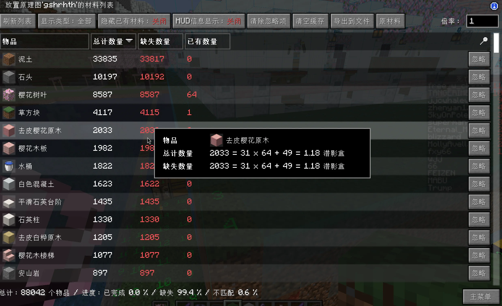

材料列表中的 HUD 信息显示开启之后，可以在右下角显示缺失材料信息：

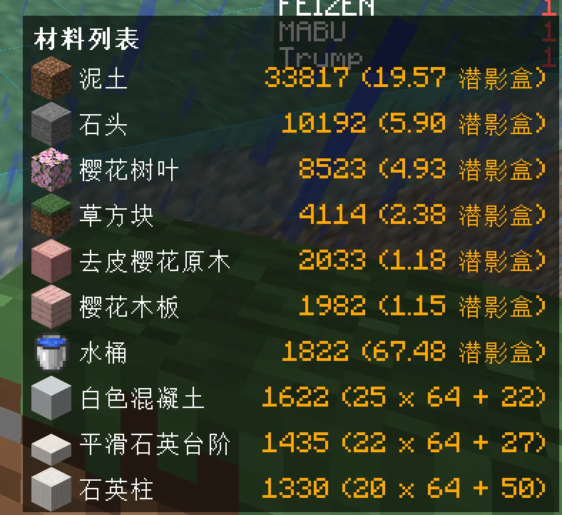

“原理验证器”可以验证原理图的状况：

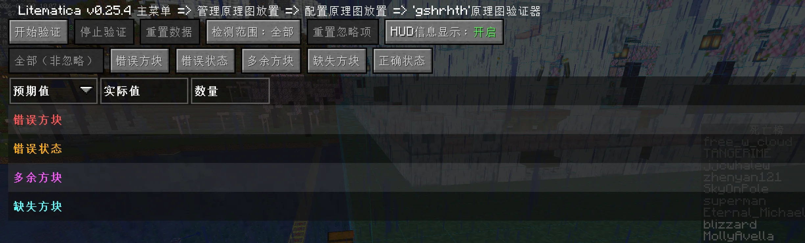

其中的颜色文字表示方块的状态。

“已锁定”功能推荐在确定好位置之后开启，防止手贱用木棍移动了原理图。

---

### 木棍功能讲解

手持木棍，左下角显示模式，`Ctrl` + 鼠标滚轮切换模式：

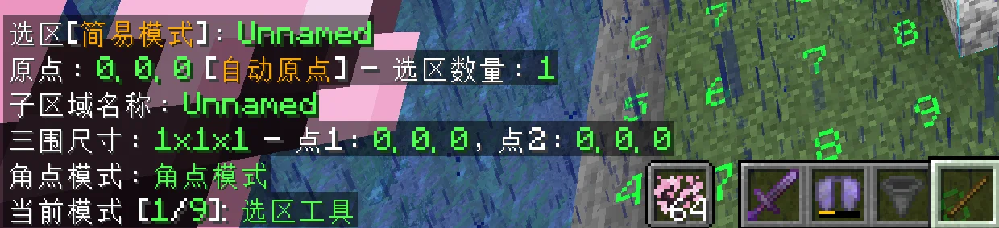

#### 模式详细讲解

1. **选取工具**，用于框选原理图  
   默认为简单模式。  
   左键和右键分别确定一个长方体的两个顶点。  
   在选择合适的区域后，打开投影菜单的“区域编辑器”：

   

   点击“保存原理图”，就可以保存原理图了。

2. **原理图放置**  
   在投影菜单加载原理图之后，默认会创建一个放置，小木棍菜单上面会显示当前的放置：

   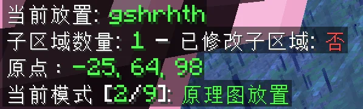

   使用 `Alt` + 鼠标滚轮可以一格一格地移动原理图。  
   具体方向规则：会移动你面对的方向。比如你面对的是南北方向，那么就会在南北方向平移，其他方向同理。  
   使用右键可以快速移动放置原点到你需要的位置，左键也可以。

3. **填充工具**  
   用于填充选区

   `Alt` + 鼠标中键：选择要填充的方块。

   使用执行操作的快捷键填充选区

4. **替换方块**  
   用于批量替换选区的方块：

   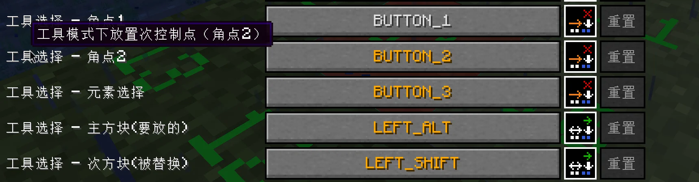

   - `Alt` + 鼠标中键：选择要放的方块。
   - `Shift` + 鼠标中键：选择要替换的方块。

   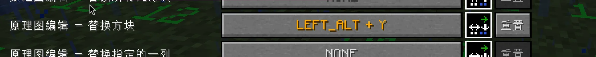

   设置一个快捷键，执行这个快捷键就可以替换方块了。
   也可以使用执行操作的快捷键，不需要新设计一个

5. **粘贴原理图**  
   使用上面配置的：

   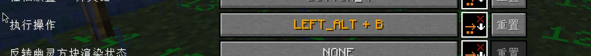

   就可以在创造模式下快速放置原理图。

6. 8. 9. 不讲。

7. **移动工具**
   注意一下:原理图放置修改的是原理图的位置
   填充工具、替换方块、移动工具和删除工具都是修改选区的，**选区和原理图**是不同的

---

### 重要技巧

#### 轻松放置模式

使用快捷键开启之后：  
如果你的背包里面有原理图匹配的方块，就可以使用轻松放置键（默认是鼠标右键）放置方块。  
可以隔空放置方块，但不能放置有状态、有朝向的方块，例如楼梯。

#### 打印模式

**！！！注意：在使用此功能前请提前咨询服务器管理员，是否允许使用。**

使用快捷键打开开关之后：  
如果你背包里面有匹配方块，就会自动放置方块，无须动手，范围是你的触及范围。  
可以放置有朝向的方块，但可能会出现一些小问题，需要手动修正。  
**不能凭空放置方块。**

因此可以和轻松放置结合起来，高效快速地放置方块。

#### 原理图渲染模式

在投影的配置菜单的“渲染层”中：

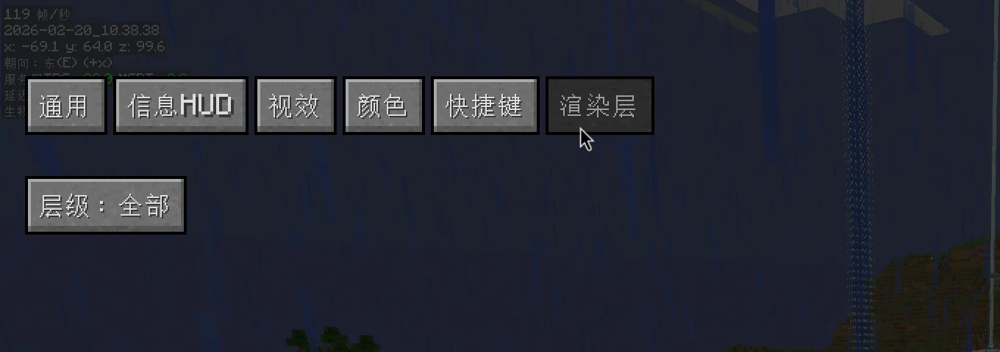

“层级”这里可以控制原理图渲染的 Y 方向的范围：

- 默认是“全部”
- 还有其他的几个选项

推荐调整到“下方所有”：

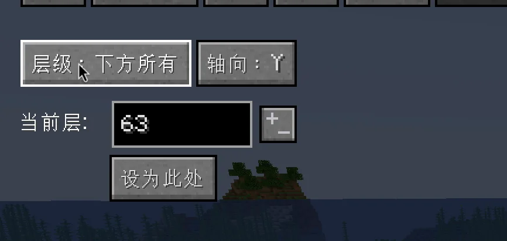

最好点击一下“设为此处”。  
然后回到游戏，你可以使用快捷键 `PageUp` 和 `PageDown` 调整层级范围，实现逐层建造功能：

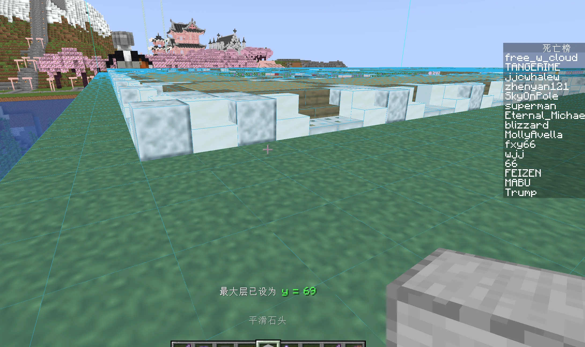  
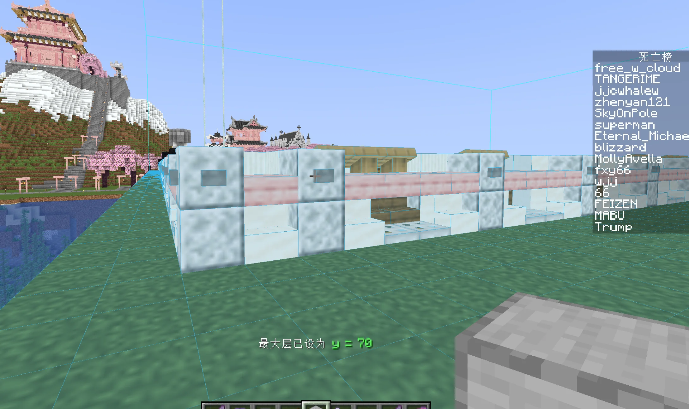  
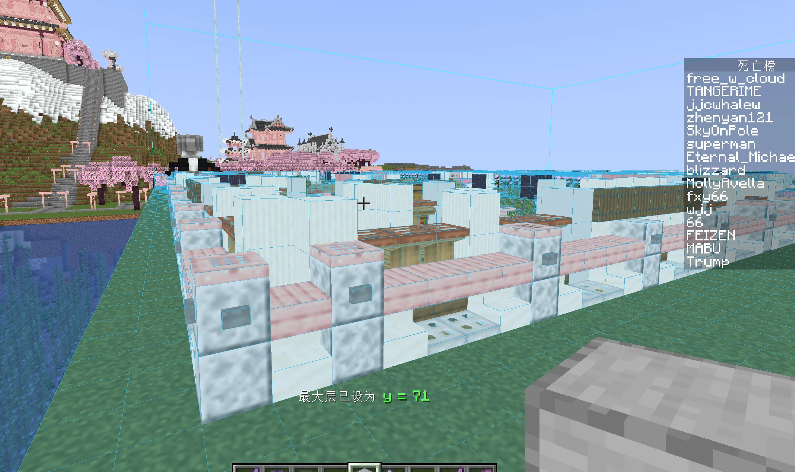

---

### 共享投影

努力编写中。
